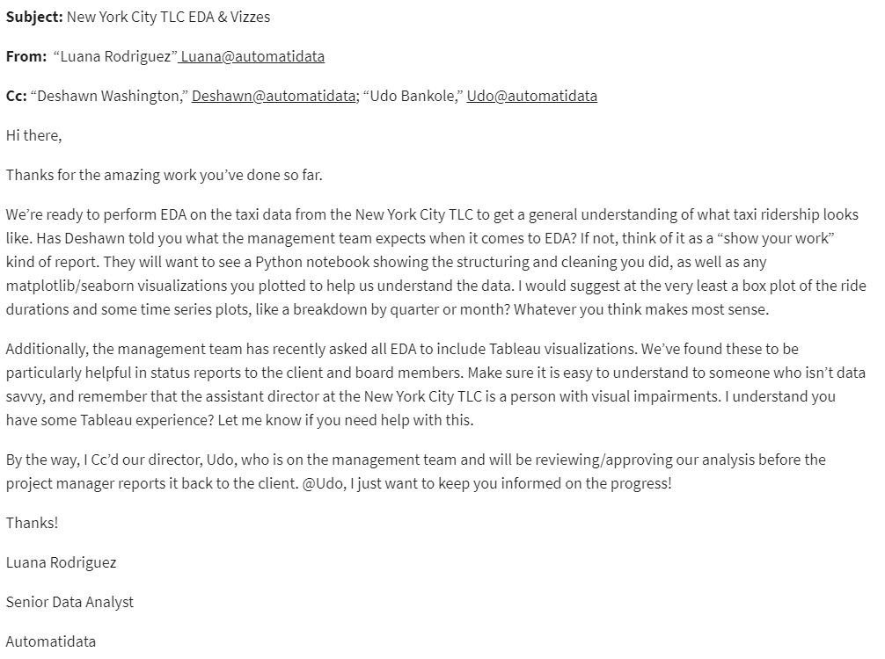
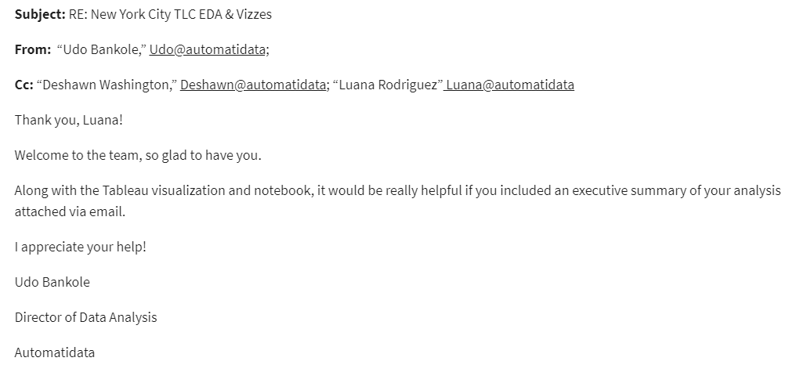
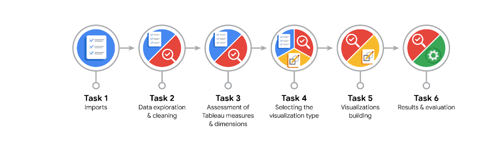
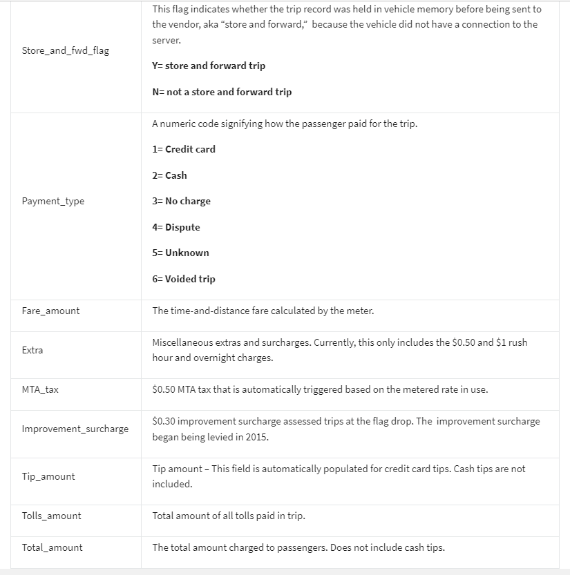

# Overview 

In this fictional scenario, the *New York City Taxi and Limousine Commission (TLC)* has approached the data consulting firm **Automatidata** to develop an app that enables TLC riders to estimate the taxi fares in advance of their ride.

# Background:

Since 1971, TLC has been regulating and overseeing the licensing of New York City's taxi cabs, for-hire vehicles, commuter vans, and paratransit vehicles.

Automatidata works with its clients to transform their unused and stored data into useful solutions, such as performance dashboards, customer-facing tools, strategic business insights, and more. They specialize in identifying a client’s business needs and utilizing their data to meet those business needs. 

# Scenario:

Automatidata is consulting for the New York City Taxi and Limousine Commission (TLC). New York City TLC is an agency responsible for licensing and regulating New York City's taxi cabs and for-hire vehicles. The agency has partnered with Automatidata to develop a regression model that helps estimate taxi fares before the ride, based on data that TLC has gathered. 

The TLC data comes from over 200,000 taxi and limousine licensees, making approximately one million combined trips per day. 

**_Note: This project's dataset was created for pedagogical purposes and may not be indicative of New York City taxi cab riders' behavior._**

The New York City TLC data is ready for exploratory data analysis (EDA) in Python. 

I have been asked to clean, join, validate, and create a visualization for the taxi commission data. The findings will be shared with internal stakeholders from different departments within Automatidata.

_**[Here](Members_List.md) is a list of the team members of Automatidata and the New York City TLC**_

The team is still in the early stages of the project for the New York City Taxi and Limousine Commission (TLC). So far, I have completed a project proposal and used Python to inspect and organize the TLC dataset.

I checked my inbox and noticed a new message from _Luana Rodriguez_, the Senior Data Analyst at Automatidata. Luana is pleased with the work I have already completed and requests my assistance with some exploratory data analysis (EDA) and data visualization. 

I also notice a follow-up email from Udo Bankole, the Director of Data Analysis. Udo suggests including an executive summary of my analysis to share with teammates. 

* _Note: Team member names used in this workplace scenario are fictional and are not representative of the New York City TLC._

**<ins>Email from Luana Rodriguez, Senior Data Analyst:**

**<ins>Email from Udo Bankole, Director of Data Analysis:**

# Reference Guide
This project has 6 tasks. The visual below identifies the various stages of the EDA phase:

# Data Dictionary
This project uses a dataset called [ 
2017_Yellow_Taxi_Trip_Data.csv](2017_Yellow_Taxi_Trip_Data.csv). 

It contains data gathered by the New York City Taxi & Limousine Commission. For each trip, there are many different data variables gathered. 

The dataset contains:

**408,294 rows** – each row represents a different trip.

**18 columns**

