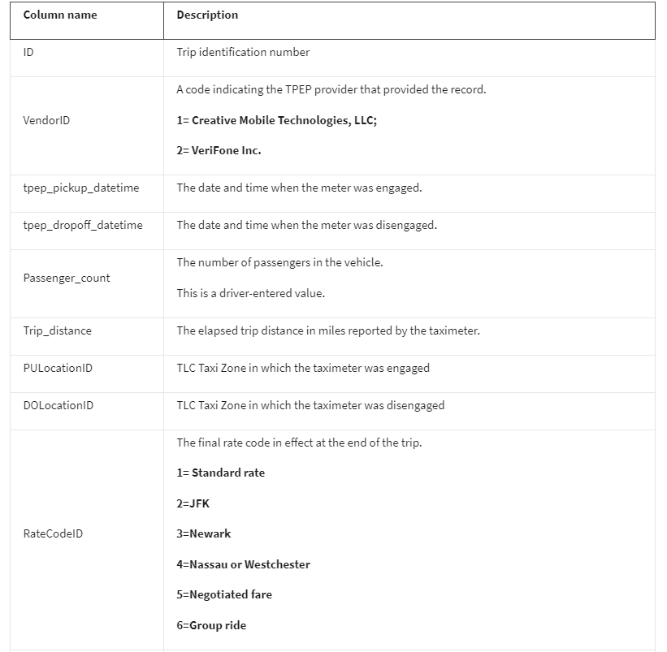

# Overview 

In this fictional scenario, the *New York City Taxi and Limousine Commission (TLC)* has approached the data consulting firm **Automatidata** to develop an app that enables TLC riders to estimate the taxi fares in advance of their ride.

# Background:

Since 1971, TLC has been regulating and overseeing the licensing of New York City's taxi cabs, for-hire vehicles, commuter vans, and paratransit vehicles.

Automatidata works with its clients to transform their unused and stored data into useful solutions, such as performance dashboards, customer-facing tools, strategic business insights, and more. They specialize in identifying a client’s business needs and utilizing their data to meet those business needs. 

# Scenario:

Automatidata is consulting for the New York City Taxi and Limousine Commission (TLC). New York City TLC is an agency responsible for licensing and regulating New York City's taxi cabs and for-hire vehicles. The agency has partnered with Automatidata to develop a regression model that helps estimate taxi fares before the ride, based on data that TLC has gathered. 

The project would be in 4 phases:
1. **Exploratory Data Analysis** of their dataset.
2. **A/B Test:** To sample data and analyze whether there is a relationship between `payment type` and `fare amount`. For example: discover if customers who use credit cards pay higher fare amounts than customers who use cash.
3. **Regression Analysis:** To predict taxi fare amounts.
4. **Machine Learning:** To build a machine learning model to predict if a customer will not leave a tip. They want to use the model in an app that will alert taxi drivers to customers who are unlikely to tip, since drivers depend on tips.

The TLC data comes from over 200,000 taxi and limousine licensees, making approximately one million combined trips per day.

**_Note: This project's dataset was created for pedagogical purposes and may not be indicative of New York City taxi cab riders' behavior._**

The New York City TLC data is ready for exploratory data analysis (EDA) in Python. 

I have been asked to clean, join, validate, and create a visualization for the taxi commission data. The findings will be shared with internal stakeholders from different departments within Automatidata.

_**[Here](Members_List.md) is a list of the team members of Automatidata and the New York City TLC**_

# PHASE 1. Exploratory Data Analysis

The team is still in the early stages of the project for the New York City Taxi and Limousine Commission (TLC). So far, I have completed a project proposal and used Python to inspect and organize the TLC dataset.

I checked my inbox and noticed a new message from _Luana Rodriguez_, the Senior Data Analyst at Automatidata. Luana is pleased with the work I have already completed and requests my assistance with some exploratory data analysis (EDA) and data visualization. 

* _Note: Team member names used in this workplace scenario are fictional and are not representative of the New York City TLC._

## <ins>Data Dictionary:
This project uses a dataset called [Taxi_Trip_Data.csv](2017_Yellow_Taxi_Trip_Data.csv).

It contains data gathered by the New York City Taxi & Limousine Commission. For each trip, there are many different data variables gathered. 

The dataset contains:

**408,294 rows** – each row represents a different trip.

**18 columns**

- Refer to [NYC Open Data](https://data.cityofnewyork.us/Transportation/2017-Yellow-Taxi-Trip-Data/biws-g3hs) for more information related to this dataset.

- Refer to the [Python Notebook](Exploratory_Data_Analysis.ipynb) for the detailed EDA phase. 

Thanks for your time.

# PHASE 2. A/B Testing

The current project for their newest client, the New York City Taxi & Limousine Commission (New York City TLC) is reaching its midpoint, having completed a project proposal, Python coding work, and exploratory data analysis.

I received a new email from Uli King, Automatidata’s project manager. Uli tells my team about a new request from the New York City TLC: to analyze the relationship between **fare amount** and **payment type**. I also discover follow-up emails from three other team members: Deshawn Washington, Luana Rodriguez, and Udo Bankole. These emails discuss the details of the analysis. 

A final email from Luana includes my specific assignment: to conduct an A/B test. 

Our A/B test result aims to find ways to generate more revenue for taxi cab drivers.

**Note:** For the purpose of this exercise, it is assumed that the sample data comes from an experiment in which customers are randomly selected and divided into two groups: 

1) customers who are required to pay with credit card, 
2) customers who are required to pay with cash. 

Without this assumption, we cannot draw causal conclusions about how payment method affects fare amount.

**The goal:** The goal for this A/B test is to sample data and analyze whether there is a relationship between **payment type** and **fare amount**. 

For example: discover if customers who use credit cards pay higher fare amounts than customers who use cash.

So, 
* What key business insight(s) emerged from our A/B test? and
* What business recommendations can be propose based on the results?
  
Refer to [AB Testing Notebook](AB_Testing.ipynb) for detailed analysis and results.

